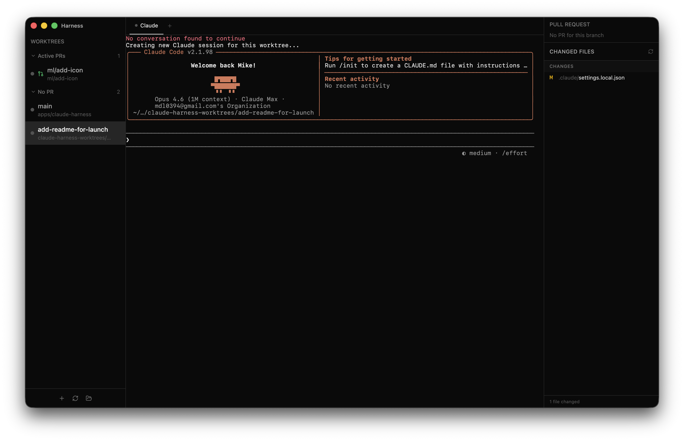

# Harness

A fairly simple UI wrapper that makes it easier to manage a bunch of LLM coding (claude code) worktrees all at once.

🌐 **Website:** [harness.mikelyons.org](https://harness.mikelyons.org/)

## Download

Grab the latest release from the [releases page](https://github.com/frenchie4111/harness/releases/latest).

- **Apple Silicon (M1/M2/M3/M4):** [Harness-1.3.0-arm64.dmg](https://github.com/frenchie4111/harness/releases/download/v1.3.0/Harness-1.3.0-arm64.dmg)
- **Intel Mac:** [Harness-1.3.0.dmg](https://github.com/frenchie4111/harness/releases/download/v1.3.0/Harness-1.3.0.dmg)

## Installation

1. Download the `.dmg` for your Mac architecture from the links above.
2. Open the `.dmg` and drag **Harness** into your Applications folder.
3. Launch Harness from Applications. The app is signed and notarized, so it should open without any Gatekeeper warnings.
4. On first launch:
   - Pick a git repository when prompted.
   - Click the ⚙ gear icon in the sidebar and paste a [GitHub personal access token](https://github.com/settings/tokens?type=beta) (fine-grained or classic, with `repo` scope). This is optional but required for the PR status panel and checks.
   - When the hooks consent banner appears, click **Enable** so Harness can install status-tracking hooks in your worktrees. These are stored in each worktree's `.claude/settings.local.json` (gitignored by default) and are what make the sidebar status dots reliable.

### Requirements

- macOS (Apple Silicon or Intel)
- [`claude`](https://code.claude.com) CLI installed and on your login shell's `PATH`
- `git` installed (preinstalled on macOS via Xcode Command Line Tools)

## Why did I build this

Honestly I have been using [Conductor](https://www.conductor.build) for a while as a fairly happy customer, but some rough edges have really started to annoy me so on a random Thursday morning I decided to build my own version of it that works the way I want to. Oh yeah did I mention:

> This app is entirely vibe coded - I literally haven't opened the code once. Future travelers be warned

# How's it work?

This app is specifically designed to be an easy way to do the sort of ADD fueled multi-worktree development that I have been in-to these days. Along the left you can see all the worktrees you have, and each worktree has it's own claude, additional terminals and PR display.

The main benefit of this is that your worktrees stay organized, and it's very obvious when one of your many claudes needs your attention (the dot will change colors)

## Worktrees

This app assumes that you are going to want to use worktrees (otherwise what's the point)

It will create a worktree directory at `../<your repo folder>-worktree` and start making worktrees there. This directory will probably be changable at some point

# "Roadmap"

- [x] Initial functionality
- [x] Proper packaging into an app and dmg for other mac users
- [x] OTA Updates
- [ ] Settings, configurability, etc
- [ ] Better persistence (PTYs don't really stay if you kill the app, which can be a bit frustrating)
- [ ] Support other LLM CLI Tools - Honestly I currently only use Claude so this probably won't happen unless I
- [ ] Notifications when cluades are ready for you (maybe peon noises?)
- [ ] Whatever else people want - add a github issue or email me directly!

# Contributing

I mean if you want? I think you probably just want to tell claude to download it and make whatever changes you want
