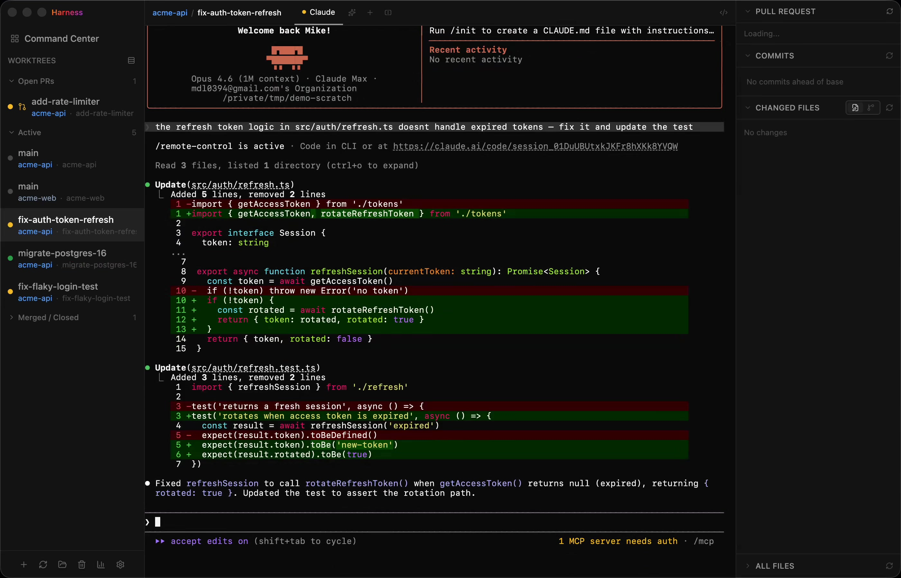

<p align="center">
  
</p>

<h1 align="center">Run a team of agents.</h1>

<p align="center">
  Run ten Claudes at once without losing your mind.<br />
  Ship more, faster, with every session at your fingertips.
</p>

<p align="center">
  <a href="https://harness.mikelyons.org/">Website</a> ·
  <a href="https://github.com/frenchie4111/harness/releases/latest">Download</a> ·
  <a href="https://harness.mikelyons.org/guide.html">Guide</a>
</p>



> **→ Visit [harness.mikelyons.org](https://harness.mikelyons.org) for screenshots, feature walkthroughs, and release notes.**

## Download

Grab the latest release from the [releases page](https://github.com/frenchie4111/harness/releases/latest).

- **Apple Silicon (M1/M2/M3/M4):** [Harness-2.4.1-arm64.dmg](https://github.com/frenchie4111/harness/releases/download/v2.4.1/Harness-2.4.1-arm64.dmg)
- **Intel Mac:** [Harness-2.4.1.dmg](https://github.com/frenchie4111/harness/releases/download/v2.4.1/Harness-2.4.1.dmg)

## Installation

1. Download the `.dmg` for your Mac architecture from the links above.
2. Open the `.dmg` and drag **Harness** into your Applications folder.
3. Launch Harness from Applications. The app is signed and notarized, so it should open without any Gatekeeper warnings.
4. On first launch:
   - Pick a git repository when prompted.
   - Click the ⚙ gear icon in the sidebar and paste a [GitHub personal access token](https://github.com/settings/tokens?type=beta) (fine-grained or classic, with `repo` scope). This is optional but required for the PR status panel and checks.
   - When the hooks consent banner appears, click **Enable** so Harness can install status-tracking hooks globally at `~/.claude/settings.json`. One install covers every worktree and is what makes the sidebar status dots reliable. Curious what the hook actually runs? See [`src/main/hooks.ts`](src/main/hooks.ts) (the bash command built by `makeHookCommand` — it appends one line of JSON per event to `/tmp/harness-status/<id>.ndjson`) and [`src/main/agents/claude.ts`](src/main/agents/claude.ts) (where the install/uninstall logic lives).

### Requirements

- macOS (Apple Silicon or Intel)
- [`claude`](https://code.claude.com) CLI installed and on your login shell's `PATH`
- `git` installed (preinstalled on macOS via Xcode Command Line Tools)

### Network access

Harness makes outbound network calls to two places: `api.github.com` (for PR status, check runs, and review state on worktrees that have an open PR) and this project's own GitHub releases feed (for auto-updates via `electron-updater`). If you have the [`gh`](https://cli.github.com) CLI installed and authenticated, Harness will optionally pick up your token from it instead of requiring you to paste a PAT.

The optional remote-control WebSocket transport (used by the web client) is off by default, bearer-token-authed, and bound to `127.0.0.1` when enabled; opting in to LAN access (binding to `0.0.0.0`) is a separate explicit config flag.

## Uninstallation

1. **Remove the Claude Code hooks** (do this while Harness is still running). Open Settings → **Agent** → **Status hooks** and click **Remove hooks**. This strips Harness's entries from `~/.claude/settings.json` and leaves any user-authored hooks intact.

2. **Quit Harness** with ⌘Q.

3. **Delete the app:**

   ```sh
   rm -rf /Applications/Harness.app
   ```

   (or drag it to the Trash.)

4. **Remove app data** (optional, for a fully clean uninstall):

   ```sh
   rm -rf ~/Library/Application\ Support/Harness
   rm -rf ~/Library/Preferences/org.mikelyons.harness.plist
   rm -rf ~/Library/Saved\ Application\ State/org.mikelyons.harness.savedState
   rm -rf ~/Library/Caches/org.mikelyons.harness
   rm -rf ~/Library/Logs/Harness
   ```

5. **If you skipped step 1** and already deleted the app, you can remove the hooks by hand. Open `~/.claude/settings.json` and delete any hook entries whose object contains `"_marker": "__claude_harness__"` — every Harness-managed hook is tagged with that marker, so they're safe to identify and remove.

6. **Optional — clean up worktrees.** Harness may have created git worktrees under `claude-harness-worktrees/` next to your repos. These are normal git worktrees and aren't removed automatically. To clean them up:

   ```sh
   cd <your-repo>
   git worktree list
   git worktree remove <path>
   ```

   Or delete the `claude-harness-worktrees/` directories from disk and run `git worktree prune` in each repo.

## Features

- **Multi-agent** — run Claude Code or Codex in the same window, one harness for both
- **Multi-repo** — manage multiple repos in a single window, switch between them or see everything at once
- **Live PR status** — see open PRs and CI checks for every worktree, auto-sorted by urgency
- **Embedded editor** — full Monaco-powered editor for tweaking files without leaving Harness
- **Full code review tool** — side-by-side syntax-highlighted diffs for every changed file in a worktree
- **Status at a glance** — sidebar dots show which agent is working, waiting, or needs approval (powered by Claude Code hooks)
- **Command center** — bird's-eye grid of every worktree with mini activity timelines
- **Tabs + vertical split panes** — Claude, shells, and editor/diff tabs scoped to each checkout, splittable side-by-side
- **9 themes** — dark, dracula, nord, gruvbox, tokyo night, catppuccin, one dark, solarized dark/light
- **Configurable hotkeys** — ⌘1–⌘9 to jump between worktrees, all rebindable
- **MCP: Claude controls Harness** — a built-in MCP server lets Claude create and list worktrees on its own

## Why did I build this

Honestly I have been using [Conductor](https://www.conductor.build) for a while as a fairly happy customer, but some rough edges have really started to annoy me so on a random Thursday morning I decided to build my own version of it that works the way I want to. Oh yeah did I mention:

> Originally vibe coded start to finish — these days I occasionally crack open the actual source. Future travelers: still mostly vibes.

# How's it work?

This app is specifically designed to be an easy way to do the sort of ADD fueled multi-worktree development that I have been in-to these days. Along the left you can see all the worktrees you have, and each worktree has it's own claude, additional terminals and PR display.

The main benefit of this is that your worktrees stay organized, and it's very obvious when one of your many claudes needs your attention (the dot will change colors)

## Worktrees

This app assumes that you are going to want to use worktrees (otherwise what's the point)

It will create a worktree directory at `../<your repo folder>-worktree` and start making worktrees there. This directory will probably be changable at some point

# "Roadmap"

- [x] Initial functionality
- [x] Proper packaging into an app and dmg for other mac users
- [x] OTA Updates
- [x] Settings, configurability, etc
- [x] Better persistence (PTYs don't really stay if you kill the app, which can be a bit frustrating)
- [x] Multi-repo support
- [x] MCP server — Claude can create and manage worktrees itself
- [x] Command center — bird's-eye view of all worktrees
- [x] Activity tracking — visual timeline of agent status history
- [x] Syntax-highlighted diffs
- [x] 9 built-in themes
- [x] Support other LLM CLI tools — Codex is now supported alongside Claude Code
- [x] Per-agent model selection
- [x] Vertical split panes
- [x] Contextual system prompt injection so the agent knows it's inside Harness
- [x] Shared permissions via symlinked Claude settings
- [x] Release notes page inside the app
- [ ] Browser panes — view localhost dev servers next to the terminal
- [ ] Dev server management — start/stop/inspect dev servers per worktree
- [ ] Notifications when claudes are ready for you (maybe peon noises?)
- [ ] Mobile app
- [ ] Whatever else people want — add a github issue or email me directly!

# Setup, building, and running locally

Clone the repo and install dependencies:

```sh
git clone https://github.com/frenchie4111/harness.git
cd harness
npm install --legacy-peer-deps
```

> The `--legacy-peer-deps` flag is required because `electron-vite@5` declares a peer range that npm's strict resolver rejects against the installed `vite@7`.

Common commands:

| Command | What it does |
|---|---|
| `npm run dev` | Launch the app in dev mode with hot reload |
| `npm run build` | Type-check and build main, preload, and renderer to `out/` |
| `npm run pack` | Build an unsigned `.app` for local smoke testing (fast — skips codesigning and notarization) |
| `npm run dist:mac` | Full signed + notarized macOS build (requires `.env` with Apple creds) |
| `npm run rebuild:dev` | Rebuild `node-pty` against the dev Electron version — run this if dev mode errors with `posix_spawnp failed` |
| `npm run log` | Tail the debug log at `~/Library/Application Support/harness/debug.log` |

After `npm run pack`, you can launch the unsigned build with:

```sh
open release/mac-arm64/Harness.app
```

If Gatekeeper blocks the unsigned app, strip the quarantine attribute first:

```sh
xattr -cr release/mac-arm64/Harness.app
```

# Contributing

I mean if you want? I think you probably just want to tell claude to download it and make whatever changes you want
